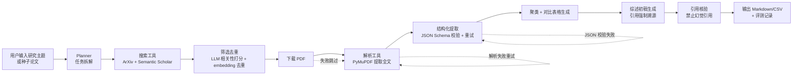

# 文献综述自动化 Agent（Literature Review Agent）项目规划

> 版本：v0.1 ｜ 日期：2026-09-13 ｜ 状态：规划阶段（未开工）
> 目标岗位对标：科大讯飞 AI Agent 应用研发工程师（J14187）
> 开发节奏：每天 1-2 小时，总周期约 8 周（阶段 0–4，每阶段有独立里程碑）

---

## 1. 项目概述

**一句话**：输入一个研究主题（或几篇种子论文），Agent 自动完成"搜索论文 → 相关性筛选去重 → 下载解析 PDF → 结构化提取 → 生成对比表格与综述初稿"的全流程。

**给谁用**：自己（科研刚需）。做 TP-CCSRD 这类需要大量文献对比的工作时，这个工具能直接提效，因此"解决了什么问题、为什么这样设计"在面试里讲起来真实可信。

**为什么做**：
1. 简历破零——这是目前简历上唯一缺的硬通货（JD 最低要求原文："真正动手完成过一个大模型应用、AI Agent、智能助手或自动化工具"）；
2. 对准 JD 加分项（见下表），做完一个项目命中八项加分；
3. 顺手把自部署的 New API 网关经验升级为"网关 + 多模型调度"的工程经历。

**JD 加分项命中清单**（做完后逐条自查）：

| JD 加分项 | 本项目对应 |
|---|---|
| 有可访问的 Agent Demo、GitHub 项目、技术博客 | Gradio Demo + GitHub + 阶段 4 技术博客 |
| 做过个人知识库 / 代码 Agent 等 | 文献知识库 + 自动化 Agent |
| 使用过主流 Agent 框架，能解释取舍 | LangGraph（+ 对比手写 ReAct，能讲取舍） |
| 有 MCP、复杂工作流、多智能体或 Agent Eval 实践 | MCP server 封装工具 + 阶段 3 评测体系 |
| 有 OCR、文档解析或多模态应用经验 | PyMuPDF 论文解析 + 可选 CLIP 图表检索 |
| 有后端服务 / Web 开发经历 | FastAPI/Gradio 后端 + Demo |
| 了解端侧推理、模型量化、性能优化 | 科研背景直接覆盖（面试时结合讲） |
| 在论文中取得有说服力的成果 | ICASSP 2027 在审 + ICIP 2026 已接收 |

---

## 2. 技术选型

| 组件 | 选型 | 说明 |
|---|---|---|
| 语言 | Python 3.11+ | 生态最全，科研主力语言 |
| LLM API | 中科大 API（`https://api.llm.ustc.edu.cn/v1`，OpenAI 兼容，Bearer Token；模型 deepseek-v4-flash-ascend / qwen 系列） | 主力，零成本 |
| 备选 API | New API 网关（`https://op.ibbbb.top:8887/v1`）；星火开放平台（本周申请，在校生有免费额度，面试可讲"熟悉星火生态"） | 限流/降级时切换 |
| Agent 编排 | LangGraph | 主流、可视化、能讲取舍；阶段 0 同时手写 ReAct loop 理解原理 |
| 论文搜索 | ArXiv API（arxiv.py）+ Semantic Scholar API（注册免费 key） | 前者拿全文，后者拿引用数/venue 做排序 |
| PDF 解析 | PyMuPDF（fitz） | 纯 CPU，轻量 |
| 向量（可选） | bge-m3 + Chroma（本地） | 用于论文去重、主题聚类、可选 RAG 问答 |
| 多模态（可选加分） | CLIP 类模型做论文图表检索 | 5060 显存足够，时间不够可砍 |
| Demo | Gradio | 最快做出可访问界面 |
| MCP | 官方 Python SDK | 把搜索/解析工具包成 MCP server（加分项，限时 1 周） |
| 日志/可观测 | JSONL 日志（时间戳/步骤/耗时/tokens/成本/状态） | 阶段 2 起持续记录 |

---

## 3. 总体架构



**核心模块**：
1. `tools/`：search_arxiv、search_semanticscholar、fetch_pdf、parse_pdf、extract_paper_info（LLM 结构化提取）、dedupe、cluster
2. `agent/`：LangGraph 状态图 + 任务规划 + 失败恢复（重试/降级/跳过）
3. `mcp_server/`：把 search/parse 包装成 MCP server（可选通道）
4. `eval/`：评测集 + 指标脚本（召回率、字段准确率）
5. `app/`：Gradio 界面 + FastAPI 后端（可选）
6. `logs/`：JSONL 运行日志

---

## 4. 分阶段实施计划（8 周，每天 1-2 小时）

### 阶段 0（第 1 周，约 10h）：环境搭建 + 最小闭环
**目标**：跑通"LLM 能调用一个工具"的最小 demo，全链路环境就绪。

**步骤**：
1. 建 conda/venv 环境（Python 3.11），安装 openai / langgraph / pymupdf / gradio / python-dotenv / arxiv
2. 写 `.env`（中科大 API base_url、key、默认模型名），配 `.gitignore`，git init
3. 用 openai SDK 实现一个**假工具**（如"查合肥天气"）的 function calling demo，验证协议通
4. 手写一个 50-100 行 ReAct loop（工具描述进 prompt + 解析模型输出），理解原理
5. 用 LangGraph 重写同一 demo（ToolNode + 状态图），对比两种实现，记录取舍结论

**验收标准**：输入"查询合肥天气"能触发本地假工具并返回结果；能口头讲清 function calling 与 ReAct 的区别。

**注意事项**：
- API key 只放 `.env`，绝不写进代码或 commit；
- Windows 下建议用 conda 管理 Python 版本（避免系统 Python 污染）；
- 若 Windows 遇到 asyncio 事件循环等怪问题，优先考虑切 WSL（Ubuntu 子系统），本项目依赖全部跨平台。

### 阶段 1（第 2-3 周，约 20h）：核心工具链
**目标**：单篇论文自动完成"搜索 → 筛选 → 下载 → 解析 → 结构化提取"，数据落 JSON。

**步骤**：
1. 封装 `search_arxiv`（arxiv.py 或 REST，按关键词搜索，取标题/摘要/作者/链接/ID）
2. 封装 `search_semanticscholar`（免费注册 key，补引用数、venue、年份用于排序）
3. 相关性筛选：LLM 打分（1-5）+ 关键词/年份过滤；去重（标题归一化 + embedding 相似度阈值 0.9）
4. 下载 PDF（arXiv 开放获取直下），PyMuPDF 提取全文（处理双栏、忽略公式乱码区）
5. 结构化提取：定义 JSON Schema（title/authors/venue/year/method/datasets/results/contribution/limitations），LLM 输出 + schema 校验 + 失败重试（最多 2 次）
6. 单篇论文结果存 `data/papers/<id>.json` + 汇总 `data/index.json`

**验收标准**：10 篇论文自动跑完；抽查 3 篇人工核对 JSON 字段正确率 ≥ 80%；全程无 key 泄漏。

**注意事项**：
- **速率限制**：arXiv 请求间隔 ≥ 1s；Semantic Scholar 无 key 限流严，注册 key 后约 5000 次/5 分钟；统一加重试装饰器；
- **PDF 解析容错**：双栏文本按块排序（PyMuPDF 默认顺序可能乱）；公式/表格乱码是常态，字段缺失标 `null` 不报错；加密 PDF 直接跳过并记录；
- **JSON 稳定性**：温度调低（0.1–0.2）、给 few-shot 示例、输出后再用 `json.loads` + schema 校验；
- 本地缓存搜索结果（`data/cache/`），避免重复调用 API 浪费 token 和触发限流。

### 阶段 2（第 4-5 周，约 20h）：Agent 化 + MCP
**目标**：LangGraph 编排全流程，加任务规划与失败恢复；工具包成 MCP server。

**步骤**：
1. LangGraph 状态图：plan → search → filter → download → parse → extract → summarize，状态对象贯穿全流程
2. 失败恢复：单篇失败不中断整体（try/except + 记录 + 跳过）；API 失败自动切换备选 API（中科大 ↔ New API 网关）
3. 生成对比表格：embedding 聚类（按主题），LLM 生成方法对比表（模型/数据集/指标/参数量/特点），导出 Markdown + CSV
4. 综述初稿：按聚类结果生成 related work 段落，**每条引用强制带 arXiv 链接与编号**
5. MCP：用官方 Python SDK 把 search/parse 包装成 MCP server，Agent 通过 MCP client 调用（保留直调路径，能讲清两种方式取舍）
6. 可观测：全程 JSONL 日志（每步耗时/调用次数/tokens/估算成本/状态码）

**验收标准**：给真实主题（如 "vision-language knowledge distillation"）端到端产出对比表 + 综述初稿；日志能回答"这轮花了多少 token、哪步最慢"。

**注意事项**：
- MCP 是加分项，**限时 1 周**，超时则退化为直调 + 文档说明取舍（不要为了 MCP 挤占主线）；
- 成本控制从此阶段开始：限制单主题最多 50 篇、复用缓存、结构化提取用短上下文；
- **幻觉引用的高危期**：prompt 里明确"所有引用必须来自检索结果，禁止自行编造"，并保留"引用核验"步骤。

### 阶段 3（第 6-7 周，约 20h）：评测 + 打磨 + Demo
**目标**：有评测数据，有可访问的 Demo。

**步骤**：
1. 构建评测集：挑 30 篇自己熟悉的论文（TP-CCSRD 相关领域），冻结"应召回清单 + 每篇关键字段"（**先冻结再测，禁止边测边改**）
2. 指标：召回率（30 篇召回几篇）、字段准确率（抽 10 篇核对）、表格可用性（人工 1-5 分）、端到端耗时与成本
3. 消融实验（体现工程深度，面试加分）：有/无 LLM 相关性排序的召回对比；不同 chunking 策略（如做 RAG 问答则对比）；成本曲线
4. Gradio 界面：输入主题 → 显示进度条 → 输出对比表 + 综述（可下载 Markdown）
5. README：项目介绍、架构图（复用第 3 节）、用法、评测结果表

**验收标准**：评测报告（含指标数字）+ Demo 本机可访问；README 完整。

**注意事项**：
- 评测集是面试的"弹药"，宁可少而精（30 篇够），别贪多；
- Demo 要处理超时与长任务（后台队列），别让用户干等页面转圈；
- 保留"失败样例"记录——面试问"经历过哪些失败"时，这是真实素材（如某篇 PDF 解析乱码、某次成本超预算）。

### 阶段 4（第 8 周，约 10h）：变现
**目标**：博客 + 简历 + 面试准备，形成可投递状态。

**步骤**：
1. 技术博客：标题方向《我用 LLM Agent 自动化了文献综述》，含踩坑记录（PDF 乱码、API 限流、幻觉引用、成本失控、去重困难），发掘金/知乎/个人博客
2. 简历：项目一条（STAR：情境/任务/行动/结果，结果用评测数字）+ 科研经历（ICASSP 在审、ICIP 已接收）+ New API 网关经历，产出 PDF
3. 模拟面试问题清单：Agent 架构设计、tool calling 原理、MCP 取舍、评测体系设计、检索质量优化、成本控制、Agent 未来趋势
4. （可选）部署到学校 4090 服务器跑 Gradio 长期挂机，作为"可访问 Demo"链接（评估网络可达性）

**验收标准**：简历 v1 + 博客上线 + 能对着问题清单连续讲 10 分钟项目。

---

## 5. 关键细节与常见坑（务必通读）

1. **API Key 安全**：只进 `.env` + `.gitignore`；GitHub 公开仓库前再自查一遍。
2. **Token 成本**：每步统计；单主题限 50 篇；提取用短上下文、汇总用聚合上下文，避免超长。
3. **速率限制**：统一重试装饰器（指数退避）；缓存搜索与解析结果；API 限流时自动切换网关。
4. **PDF 解析容错**：双栏按块排序；乱码/加密跳过；字段缺失标 null 不中断。
5. **结构化输出**：JSON Schema + 低温 + few-shot + 校验重试，三重保险。
6. **去重**：标题归一化（小写/去空格/去 arXiv 版本号）+ embedding 相似度阈值。
7. **引用溯源（红线）**：综述里每条引用必须来自检索结果并带 arXiv 链接；保留核验步骤；这是 Agent 类产品最容易翻车、面试最容易被追问的点。
8. **失败恢复**：单篇失败不影响全流程；每步 try/except + 日志。
9. **可观测**：JSONL 日志从阶段 2 开始，后期可加简单面板。
10. **Windows 编码**：中文路径/文件名注意 UTF-8；必要时切 WSL。
11. **版本管理**：每阶段 commit，commit message 规范——既是工程习惯，也是简历里的工程素养素材。
12. **时间护栏**：MCP、多模态、部署全是加分项，各自限时，超时砍掉也要保住主线（搜索→提取→表格→综述）。

---

## 6. 评测方案（阶段 3 冻结）

| 指标 | 定义 | 目标值 |
|---|---|---|
| 召回率 | 评测集 30 篇中成功召回并提取的篇数 / 30 | ≥ 80%（24 篇） |
| 字段准确率 | 抽查 10 篇，JSON 关键字段（method/datasets/results）人工核对 | ≥ 80% |
| 表格可用性 | 生成对比表人工评分（1-5） | ≥ 4 |
| 端到端成本 | 单主题 30 篇总 token 消耗换算成本 | 记录即可，不设硬目标 |
| 端到端耗时 | 单主题全流程耗时 | 记录即可，不设硬目标 |

---

## 7. 算力与环境说明

**结论：本项目不需要 4090 服务器，RTX 5060 Windows 本地完全够用。**

原因：
- 所有大模型推理走中科大 API（云端），本地零推理负担；
- 本地仅跑 PDF 解析（CPU）、编排逻辑、Gradio（轻量）；
- 可选的本地位移组件（bge-m3 embedding ≈ 1GB 显存、CLIP 图表检索 ≈ 数百 MB）在 5060 的 8GB 显存上绰绰有余；
- 甚至全程 CPU 也能跑通（只是 embedding 慢一点），GPU 不是门槛。

**4090 服务器（Ubuntu 24GB）的可选用途**（非必需，第 7 周再评估）：
1. 长期部署 Gradio Demo 对外开放 → 落实"可访问的 Agent Demo"加分项（需确认服务器是否有可达地址）；
2. 批量评测时多进程解析 PDF，CPU/内存更从容。

**Windows 本地开发注意事项**：
- 用 conda/venv 隔离环境；优先 conda 管 Python；
- 若遇 asyncio/路径/编码怪问题 → 切 WSL（Ubuntu）开发，代码天然跨平台；
- `.env` 配置：`OPENAI_BASE_URL=https://api.llm.ustc.edu.cn/v1`、`OPENAI_API_KEY=<key>`、`MODEL=deepseek-v4-flash-ascend`（按实际可用模型调整）。

---

## 8. 交付物清单

1. 可运行的项目仓库（GitHub 公开），含 README（架构图 + 用法 + 评测结果）
2. 可访问的 Gradio Demo（本机即可，可选部署服务器）
3. 评测报告（指标数字 + 消融对比 + 失败样例记录）
4. 技术博客 ≥ 1 篇（踩坑与改进）
5. 简历项目条目（STAR + 数据）
6. 面试问答弹药库（含模拟问题与参考答案要点）

---

## 9. 风险与对策

| 风险 | 对策 |
|---|---|
| 每天 1-2 小时被科研/课程打断，进度延期 | 每阶段有"最小可交付"，最坏情况砍加分项保主线；与导师提前沟通好节奏 |
| API 限流/不稳定 | 重试 + 双 API 切换 + 本地缓存 |
| LLM 幻觉引用（综述编造文献） | 引用必须来自检索结果 + 强制带链接 + 核验步骤 |
| 结构化输出不稳定 | JSON Schema + 低温 + few-shot + 校验重试 |
| Windows 环境坑 | conda 隔离；备选 WSL |
| 项目做完显得"玩具" | 锚定真实需求（自己写 related work 真会用）+ 评测数据说话 + 博客记录真实迭代 |
| 时间不够导致 MCP/多模态没做 | 明确它们是加分项，砍掉不影响主线命中 JD 最低要求 |

---

## 10. 里程碑总览

```
W1  ✅ 环境就绪 + LLM 调用工具的最小闭环
W3  ✅ 单篇论文自动提取（10 篇跑通，字段准确率 ≥80%）
W5  ✅ 端到端综述流程 + MCP 接入 + 日志可观测
W7  ✅ 评测报告 + Demo + README
W8  ✅ 博客 + 简历 + 面试弹药库 → 投递准备完成
```

> 备注：本计划按"每天 1-2 小时"设计；若某周时间更充裕可提前，若被科研挤压则优先保证阶段 0–1（工具链是地基）。
