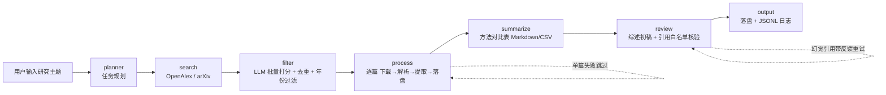

# 📚 文献综述自动化 Agent（Literature Review Agent）

> 输入一个研究主题，Agent 自动完成 **搜索论文 → 相关性筛选 → 下载解析 PDF → 结构化提取 → 生成方法对比表与综述初稿** 的全流程，每条引用强制溯源、禁止幻觉。

## ✨ 核心能力

- **一句话出综述**：`python main.py run "vision-language knowledge distillation"` → 输出对比表（Markdown/CSV）+ 综述初稿（Markdown）
- **全流程 Agent 化**：LangGraph 状态图编排（planner → search → filter → process → summarize → review → output），JSONL 日志回答"哪步最慢、花了多少 token"
- **可靠性工程**：四层防线（低温/few-shot/Schema/重试）、原子写、幂等 upsert、429 快速失败、排序降级、引用白名单核验
- **可插拔搜索源**：OpenAlex 主通道（无 key、限流宽松）+ arXiv 备用
- **评测体系**：30 篇冻结评测集 + 半自动判定（机器判 datasets、人工判 method/results）

## 📊 评测结果（2026-09-18）

| 指标 | 结果 | 目标 |
|---|---|---|
| 召回率（标题关键词逐篇） | **84.6%**（22/26，未命中为 OpenAlex 未收录） | ≥80% ✅ |
| 字段准确率（method/results，抽查 10 篇人工核对） | **95%**（19/20） | ≥80% ✅ |
| 提取成功率 | 30/30 篇 | - ✅ |
| 负例误召回 | 0/4 | 低 ✅ |
| 单篇提取成本 | 平均 4,803 tokens（qwen3.5，30-90s/篇） | 可观测 ✅ |

详见 [`eval/report_final.md`](./eval/report_final.md)。

## 🏗 总体架构



## 📁 目录结构

```
literature-agent/
├── README.md / PROJECT_PLAN.md   # 说明 + 8 周规划
├── .env.example                  # 环境变量模板（.env 不入库）
├── config.py                     # 全局配置（主/备 API、代理、限速）
├── main.py                       # CLI：demo / search / run / eval / demo-weather
├── client.py                     # OpenAI 客户端工厂（统一直连策略）
├── tools/                        # 工具链（可独立测试、可包 MCP）
│   ├── models.py                 #   PaperCandidate 统一数据模型
│   ├── schemas.py                #   PaperInfo JSON Schema + 校验（四层防线）
│   ├── search_openalex.py        #   OpenAlex 搜索主通道（mailto 礼貌池 + 限速器）
│   ├── search_arxiv.py           #   arXiv 搜索备用（REST + 降级链 + 缓存）
│   ├── fetch_pdf.py              #   PDF 下载（浏览器 UA）
│   ├── parse_pdf.py              #   PyMuPDF 解析（双栏排序）
│   ├── extract_paper_info.py     #   LLM 结构化提取（校验重试 + token 统计）
│   ├── rank.py                   #   相关性筛选（批量打分 + 保守策略）
│   ├── dedupe.py                 #   标题归一化去重
│   ├── summarize.py              #   对比表（LLM 压缩 + 程序保证格式）
│   ├── review.py                 #   综述 + 引用白名单核验（self-correct）
│   ├── io.py                     #   落盘（原子写 + 幂等索引）
│   ├── logger.py                 #   JSONL 运行日志
│   └── pipeline.py               #   单篇流水线（搜索源可插拔）
├── agent/                        # LangGraph 编排
│   ├── state.py / planner.py     #   状态对象 / 任务规划
│   ├── nodes.py / graph.py       #   7 节点实现 / 图组装
│   └── retry.py                  #   统一重试 + 主备降级
├── eval/                         # 评测
│   ├── dataset/                  #   冻结评测集（30 篇 + gold）
│   ├── metrics.py / run_eval.py  #   指标 / 对照表与报告
│   └── report_final.md           #   最终评测报告
├── app/                          # Gradio Demo
│   └── demo.py                   #   输入主题 → 进度 → 表格 + 综述
├── scripts/                      # 验证/诊断脚本（verify_*/diag_*）
└── tests/                        # 单元测试
```

## 🚀 快速开始

```bash
# 1. 环境
conda create -n lit-agent python=3.11 -y && conda activate lit-agent
pip install -r requirements.txt

# 2. 配置（.env 填入中科大 API key；OpenAlex 填邮箱提升限流）
copy .env.example .env

# 3. 跑起来
python main.py search "CLIP knowledge distillation" --max 10   # 命令行流水线
python main.py run "CLIP knowledge distillation" --max 8       # 图版 Agent（含表格+综述）
python main.py demo                                             # Gradio 网页 Demo（127.0.0.1:7860）
python main.py eval --recall                                   # 召回率评测
```

## 🛠 关键设计（面试弹药）

> 项目配套有《面试亮点》与《问题链路与修复》两份文档（开发过程沉淀的实战踩坑与取舍结论）。

| 设计 | 一句话 |
|---|---|
| 四层防线 | 低温→few-shot→Schema 校验→重试兜底，LLM 输出不可信的分层防御 |
| 原子写 + 幂等 upsert | tmp+rename 防断电半截文件；索引去重保证重跑不产生重复 |
| 429 快速失败 | 重试预算匹配错误恢复时间（抖动秒级可重试、限流分钟级放弃） |
| 引用白名单 | 生成时白名单约束 + 程序核验 + 带反馈重试，杜绝幻觉引用 |
| 半自动评测 | 机器判确定性指标（datasets/召回），人工判语义指标（method/results） |
| 搜索源可插拔 | PaperCandidate 抽象隔离变化点，换源只改一个转换函数 |

## ⚠️ 安全红线

- API Key 只放 `.env`（gitignore），绝不入库
- 综述引用必须来自检索结果并带链接，程序核验防幻觉
- 缓存一切可缓存结果；单主题论文数上限 20（Demo 默认 8）

## 🗺 里程碑

```
W1  ✅ 环境就绪 + LLM 最小闭环（手写 ReAct + LangGraph 对比）
W3  ✅ 核心工具链（搜索/下载/解析/提取/落盘 + 10 篇验收）
W5  ✅ LangGraph 编排 + 对比表 + 综述初稿 + JSONL 可观测
W7  ✅ 评测报告（字段准确率 95%）+ Gradio Demo + README
W8  🚧 博客 + 简历 + 面试弹药库
```
